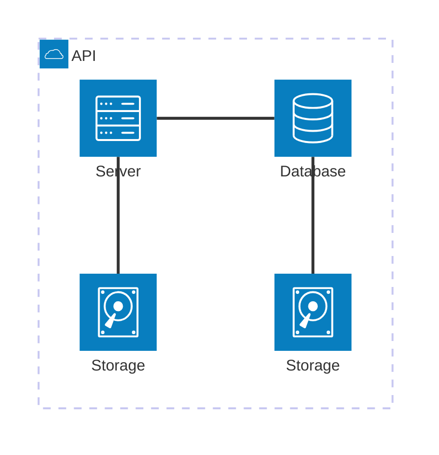

# BigBlueButton Room Media Connector



This software system is used to connect media devices inside a room to a BigBlueButton meeting.
This allows to streamline the experience of online users by capturing the best media devices of the room (microphones, cameras).
It also improves the experience for the in-site audience, by displaying the most relevant content, given the available displays.

⚠ This project is a prototype to showcase the capabilities of BBB in a hybrid setting.
It obviously misses a lot of features and *will* break in any kind of production setting.

## Architecture

The system consists of three software components that need to be run and configured in order to work:

1. The [room appliance application](appliance-application) needs to be run on a device (like Intel NUC) that connects to the room's audiovisual input and output devices. It holds the room configuration, i.e. how the media devices should be used in BBB and displays a PIN number that is used to pair the room with a BBB meeting.
2. The [BBB HTML Plugin](html-plugin) is where you enter the PIN number displayed on the appliance to connect the running meeting to the room.
3. The [room hub](room-hub) brokers the connection between the appliance in the room and the BBB meeting.

Both the Plugin and the appliance application use the GraphQL interface of BBB 3 to communicate with BBB server.


## Docker compose

1. create a folder "plugins/plugins/room-connector-plugin"
2. https://plugin-test2-bigbluebutton-openstack.uni-osnabrueck.de/plugins/room-connector-plugin/manifest.json

Caddyfile:
```
room-connector.example.com {
    
    # BBB PLugin
    root * /srv
    file_server

    # Room Hub
    route /room-hub* {
        uri strip_prefix /room-hub
        reverse_proxy room_hub:8080
    }

}
```

Nginx:
```
location /hybrid {
  proxy_pass http://127.0.0.1:5000/;
  proxy_http_version 1.1;
  proxy_set_header Upgrade $http_upgrade;
  proxy_set_header Connection "Upgrade";
}
```
